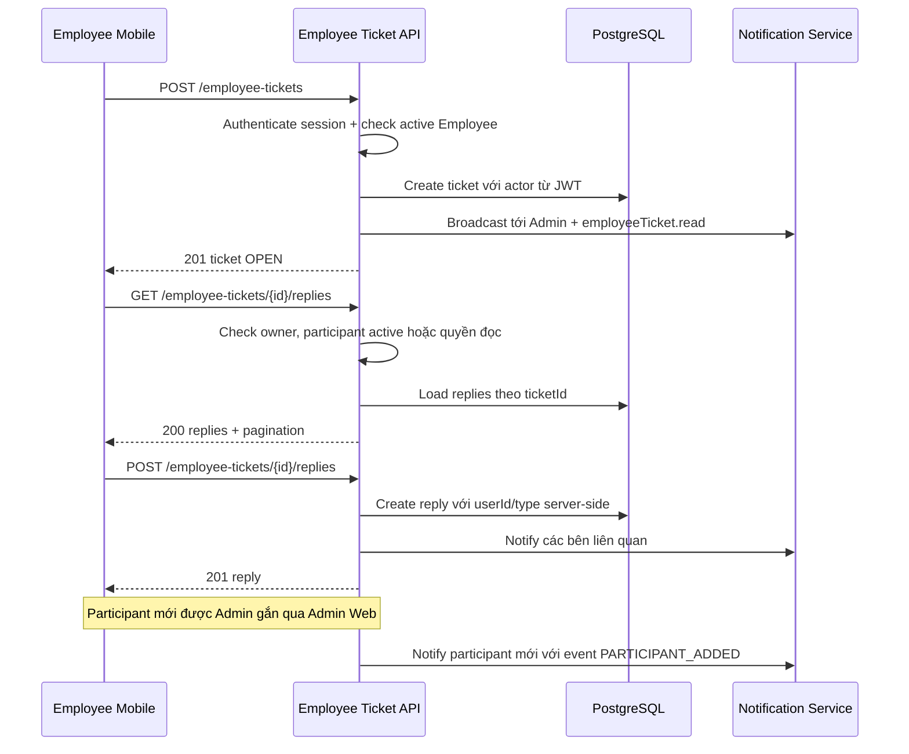

# Employee Ticket — Mobile API cho nhân viên

Tài liệu tích hợp module ticket nội bộ dành cho app mobile nhân viên.

## 1. Phạm vi module

Employee Ticket là bounded context riêng, không dùng chung entity hoặc API với ticket khách hàng.

- Nhân viên active có thể tạo ticket và trao đổi trên ticket của mình.
- Admin xem được toàn bộ ticket.
- MANAGER có quyền `employeeTicket.read` xem được toàn bộ ticket; để cập nhật trạng thái/đóng ticket cần thêm `employeeTicket.update`.
- Owner hoặc participant đang hoạt động chỉ xem/reply được các ticket mà họ sở hữu hoặc được gắn vào.
- Chỉ Admin được thêm hoặc gỡ participant; MANAGER không được quản lý participant dù có quyền `read`/`update`.
- Ticket mới được broadcast notification tới toàn bộ Admin và MANAGER active có quyền `employeeTicket.read`.
- Quyền tạo, nhân viên sở hữu và người reply đều được xác định từ session/JWT phía server.
- Mobile không được gửi `employeeId`, `createdByUserId`, `userId` hoặc `type` của reply để thay thế actor hiện tại.

## 2. Base URL và authentication

Các endpoint được mount dưới prefix `/v1`:

```text
{BE_BASE_URL}/v1/employee-tickets
```

BE hiện dùng session cookie của flow `authenticate`. Mỗi request cần giữ và gửi:

- Cookie `accessToken`.
- Cookie `refreshToken`.
- Cookie phải được lưu trong cookie jar của app mobile và gửi lại ở các request tiếp theo.

Ví dụ dạng HTTP:

```http
GET /v1/employee-tickets HTTP/1.1
Host: api.example.com
Cookie: accessToken=<access-token>; refreshToken=<refresh-token>
```

> Lưu ý: middleware hiện tại không đọc `Authorization: Bearer ...`. Nếu app mobile muốn dùng Bearer token thay cho cookie, cần triển khai một nhánh mobile authentication riêng trước khi tích hợp production.

## 3. Quyền truy cập

| Actor                                  |                         Tạo ticket |        Xem ticket |             Reply |                     Đổi trạng thái/đóng |
| -------------------------------------- | ---------------------------------: | ----------------: | ----------------: | --------------------------------------: |
| Nhân viên active, có liên kết Employee |                                 Có |   Ticket của mình |   Ticket của mình |                                   Không |
| Admin active                           | Có nếu có liên kết Employee active |            Tất cả |            Tất cả |                                      Có |
| MANAGER active + `employeeTicket.read` | Có nếu có liên kết Employee active |            Tất cả |            Tất cả | Chỉ khi có thêm `employeeTicket.update` |
| Owner/participant active               |                              Không |  Ticket liên quan |  Ticket liên quan |                                   Không |
| Role khác có `employeeTicket.read`     | Có nếu có liên kết Employee active | Owner/participant | Owner/participant |                                   Không |
| User không có quyền và không liên quan |                              Không |             Không |             Không |                                   Không |
| User account inactive                  |                              Không |             Không |             Không |                                   Không |

`POST /employee-tickets` hiện yêu cầu account có liên kết với Employee đang active, không phân biệt role. Vì vậy Admin/MANAGER có quyền đọc nhưng không có liên kết Employee active vẫn quản lý được ticket nhưng không tạo ticket mới qua endpoint này. Employee inactive cũng mất quyền owner; MANAGER chỉ có quyền xem toàn bộ khi có `employeeTicket.read`.

Quyền được kiểm tra lại từ database ở mỗi request; không dùng role hoặc `employeeId` do client tự gửi.

## 4. Enum cố định

### 4.1. Loại ticket — `type`

| Value                | Ý nghĩa đề xuất        |
| -------------------- | ---------------------- |
| `PAYROLL_BENEFITS`   | Lương và phúc lợi      |
| `ATTENDANCE_LEAVE`   | Chấm công và nghỉ phép |
| `CONTRACT_PROFILE`   | Hợp đồng và hồ sơ      |
| `WORK_ASSIGNMENT`    | Công việc và phân công |
| `EQUIPMENT_IT`       | Thiết bị và IT         |
| `OPERATION_INCIDENT` | Sự cố vận hành         |
| `FEEDBACK_REQUEST`   | Kiến nghị và yêu cầu   |
| `OTHER`              | Khác                   |

### 4.2. Trạng thái — `status`

| Value         | Ý nghĩa         |
| ------------- | --------------- |
| `OPEN`        | Ticket mới mở   |
| `IN_PROGRESS` | Đang được xử lý |
| `RESOLVED`    | Đã xử lý        |
| `CLOSED`      | Đã đóng         |

Quy tắc hiện tại:

- Ticket mới luôn được server đặt là `OPEN`.
- Reply từ Admin/người được phân quyền sẽ chuyển ticket `OPEN` sang `IN_PROGRESS`.
- Ticket `CLOSED` không được cập nhật trạng thái tiếp.
- Không được gửi lại cùng trạng thái hiện tại.

### 4.3. Loại người reply — `reply.type`

Server tự sinh, mobile chỉ đọc:

- `ADMIN`
- `AUTHORIZED_USER`
- `EMPLOYEE`
- `SYSTEM`

## 5. Response envelope

Tất cả response thành công dùng format:

```json
{
  "statusCode": 200,
  "success": true,
  "message": "OK",
  "data": {}
}
```

Endpoint list có thêm `pagination`:

```json
{
  "statusCode": 200,
  "success": true,
  "message": "OK",
  "data": [],
  "pagination": {
    "totalRecords": 1,
    "currentPage": 1,
    "size": 20,
    "totalPages": 1
  }
}
```

Error response:

```json
{
  "statusCode": 403,
  "success": false,
  "message": "Bạn không có quyền truy cập ticket nội bộ",
  "errors": null,
  "timestamp": "2026-08-27T00:00:00.000Z"
}
```

## 6. API endpoints

### 6.1. Tạo ticket — nhân viên mobile

```http
POST /v1/employee-tickets
Content-Type: application/json
```

Request body:

```json
{
  "type": "PAYROLL_BENEFITS",
  "priority": 3,
  "issue": "Chưa nhận được phụ cấp tháng 8",
  "description": "Em chưa thấy khoản phụ cấp tháng 8 trong bảng lương.",
  "attachments": [
    {
      "uid": "file-1",
      "name": "bang-luong.png",
      "url": "https://storage.example.com/file-1.png",
      "mimeType": "image/png",
      "size": 245678
    }
  ],
  "tempId": "8d9c0f3c-4ac4-4a89-a6d7-0a3d977e7a01"
}
```

Fields:

| Field         | Required | Quy tắc                                      |
| ------------- | -------: | -------------------------------------------- |
| `type`        |       Có | Một trong các enum ở mục 4.1                 |
| `priority`    |    Không | Integer từ `1` đến `5`, mặc định `3`         |
| `issue`       |       Có | Trim, dài `1–255` ký tự                      |
| `description` |       Có | Trim, dài `1–20.000` ký tự                   |
| `attachments` |    Không | Tối đa `10` object metadata                  |
| `tempId`      |    Không | UUID, dùng nếu flow upload/file cần đối soát |

Server tự gán:

```text
employeeId      = employeeId của user đăng nhập
createdByUserId = userId của user đăng nhập
status          = OPEN
```

Response: HTTP `201`, `data` là ticket vừa tạo.

### 6.2. Danh sách ticket

```http
GET /v1/employee-tickets?page=1&size=20&status=OPEN&type=PAYROLL_BENEFITS&sortBy=createdAt&sortOrder=DESC
```

Query params:

| Param       |    Mặc định | Quy tắc                            |
| ----------- | ----------: | ---------------------------------- |
| `page`      |         `1` | Số nguyên dương                    |
| `size`      |        `20` | Số nguyên dương, tối đa `200`      |
| `keyword`   |           — | Tìm trong `issue` và `description` |
| `status`    |           — | Lọc theo status enum               |
| `type`      |           — | Lọc theo type enum                 |
| `sortBy`    | `createdAt` | Tên field sort                     |
| `sortOrder` |      `DESC` | `ASC` hoặc `DESC`                  |

Kết quả phụ thuộc actor:

- Admin hoặc MANAGER có `employeeTicket.read`: trả toàn bộ ticket.
- Owner: trả ticket do chính mình tạo.
- Participant active: trả ticket đã được gắn vào participant ACL.
- Role khác có `employeeTicket.read` nhưng không phải Admin/MANAGER: không được coi là broadcast reader; chỉ thấy ticket owner/participant.

Response: HTTP `200`, `data` là mảng ticket và có `pagination`.

### 6.3. Chi tiết ticket

```http
GET /v1/employee-tickets/{id}
```

Response: HTTP `200`.

`data` có các field chính:

```json
{
  "id": "ticket-uuid",
  "employeeId": "employee-uuid",
  "createdByUserId": "user-uuid",
  "type": "PAYROLL_BENEFITS",
  "priority": 3,
  "issue": "Chưa nhận được phụ cấp tháng 8",
  "description": "Em chưa thấy khoản phụ cấp tháng 8 trong bảng lương.",
  "attachments": [],
  "status": "OPEN",
  "employee": {
    "id": "employee-uuid",
    "code": "NV001",
    "name": "Nguyễn Văn A",
    "phone": "0900000000"
  },
  "createdByUser": {
    "id": "user-uuid",
    "name": "Nguyễn Văn A",
    "role": "EMPLOYEE",
    "employeeId": "employee-uuid"
  },
  "createdAt": "2026-08-27T08:00:00.000Z",
  "updatedAt": "2026-08-27T08:00:00.000Z"
}
```

### 6.4. Lấy danh sách reply

```http
GET /v1/employee-tickets/{ticketId}/replies?page=1&size=20&sortBy=createdAt&sortOrder=ASC
```

Query dùng chung pagination với mục 6.2. BE luôn giới hạn reply theo ticket cha trong URL.

Response: HTTP `200`, `data` là mảng reply và có `pagination`.

Ví dụ một reply:

```json
{
  "id": "reply-uuid",
  "employeeTicketId": "ticket-uuid",
  "userId": "admin-uuid",
  "content": "Bộ phận nhân sự sẽ kiểm tra và phản hồi trong hôm nay.",
  "type": "ADMIN",
  "attachments": [],
  "user": {
    "id": "admin-uuid",
    "name": "Quản trị viên",
    "role": "ADMIN",
    "employeeId": null
  },
  "createdAt": "2026-08-27T09:00:00.000Z",
  "updatedAt": "2026-08-27T09:00:00.000Z"
}
```

### 6.5. Gửi reply

```http
POST /v1/employee-tickets/{ticketId}/replies
Content-Type: application/json
```

Request body:

```json
{
  "content": "Em gửi thêm ảnh bảng lương để anh/chị kiểm tra.",
  "attachments": [
    {
      "uid": "file-2",
      "name": "bang-luong-chi-tiet.png",
      "url": "https://storage.example.com/file-2.png",
      "mimeType": "image/png",
      "size": 198765
    }
  ]
}
```

| Field         | Required | Quy tắc                     |
| ------------- | -------: | --------------------------- |
| `content`     |       Có | Trim, dài `1–20.000` ký tự  |
| `attachments` |    Không | Tối đa `10` object metadata |

Không gửi các field sau:

```text
employeeTicketId, userId, type
```

Server tự xác định các field này từ URL, user session và quan hệ owner/quyền.

Response: HTTP `201`, `data` là reply vừa tạo.

Sau khi reply:

- Reply của Admin/người được phân quyền chuyển `OPEN` thành `IN_PROGRESS`.
- Các user có quyền đọc nhận notification, trừ người vừa reply.
- Người tạo ticket nhận notification khi có reply quản trị.

### 6.6. Cập nhật trạng thái

Chỉ Admin hoặc MANAGER active có cả `employeeTicket.read` và `employeeTicket.update`.

```http
PUT /v1/employee-tickets/{id}/status
Content-Type: application/json
```

Request body:

```json
{
  "status": "RESOLVED"
}
```

Response: HTTP `200`, `data` là ticket sau cập nhật.

### 6.7. Đóng ticket

```http
POST /v1/employee-tickets/{id}/close
```

Không cần request body. Response: HTTP `200`, `data` là ticket với `status = CLOSED`.

### 6.8. Danh sách participant của ticket

Endpoint này dành cho mọi actor đã có quyền xem ticket; app mobile có thể dùng để hiển thị thành viên đang trao đổi.

```http
GET /v1/employee-tickets/{ticketId}/participants
```

Response: HTTP `200`, `data` là danh sách participant active:

```json
[
  {
    "id": "participant-uuid",
    "employeeTicketId": "ticket-uuid",
    "userId": "manager-uuid",
    "addedByUserId": "admin-uuid",
    "removedByUserId": null,
    "user": {
      "id": "manager-uuid",
      "name": "Nguyễn Văn B",
      "code": "NV002",
      "email": "b@example.com",
      "phone": "0912345678",
      "role": "MANAGER",
      "employeeId": "employee-uuid"
    },
    "addedByUser": {
      "id": "admin-uuid",
      "name": "Quản trị viên",
      "role": "ADMIN"
    },
    "createdAt": "2026-08-27T09:00:00.000Z",
    "updatedAt": "2026-08-27T09:00:00.000Z"
  }
]
```

Chỉ các membership chưa bị xoá mềm được trả về. Owner không tự động xuất hiện trong danh sách participant vì owner đã có quyền từ quan hệ tạo ticket.

### 6.9. Thêm một hoặc nhiều participant — chỉ Admin

Đây là API cho Admin Web hoặc màn quản trị tương lai. App mobile nhân viên không cần gọi API này.

```http
POST /v1/employee-tickets/{ticketId}/participants
Content-Type: application/json
```

Request body:

```json
{
  "userIds": ["manager-uuid", "employee-uuid"]
}
```

Quy tắc:

- `userIds` bắt buộc là mảng UUID, từ `1` đến `50` phần tử.
- User phải active, là tài khoản đi qua employee-ticket router (`ADMIN`, `MANAGER`, `EMPLOYEE`) và không phải tài khoản khách hàng.
- Không được thêm ticket creator làm participant.
- ID trùng trong cùng request được loại bỏ.
- Participant đang active được bỏ qua, nên request có thể retry an toàn.
- Toàn bộ request atomic: nếu có một user không hợp lệ thì không participant nào được tạo.

Response: HTTP `201`, `data` là danh sách participant active sau khi thêm.

Khi thêm thành công, từng user mới nhận notification có metadata:

```json
{
  "employeeTicketId": "ticket-uuid",
  "event": "PARTICIPANT_ADDED"
}
```

### 6.10. Gỡ participant — chỉ Admin

```http
DELETE /v1/employee-tickets/{ticketId}/participants/{userId}
```

Response: HTTP `200`, `data` là `null`. Thao tác là soft-delete; participant đã gỡ không còn nhận notification/reply access qua membership đó. Có thể thêm lại sau bằng API mục 6.9.

### 6.11. Tìm candidate participant — Admin Web

```http
GET /v1/employee-tickets/participant-candidates?keyword=nguyen&page=1&size=20
```

Endpoint chỉ dành cho Admin để tìm tài khoản nội bộ active trước khi gọi API thêm participant. Mobile nhân viên không cần tích hợp endpoint này.

## 7. Notification cho app mobile

Khi ticket hoặc reply tạo thành công, app nên refresh notification theo module notification hiện có. Payload notification liên quan employee ticket có dạng metadata:

```json
{
  "title": "Ticket nội bộ mới: Chưa nhận được phụ cấp tháng 8",
  "content": "Em chưa thấy khoản phụ cấp tháng 8 trong bảng lương.",
  "type": "ALERT",
  "objectId": "ticket-uuid",
  "metadata": {
    "employeeTicketId": "ticket-uuid",
    "employeeId": "employee-uuid",
    "type": "PAYROLL_BENEFITS",
    "priority": 3
  }
}
```

Khi nhận notification có `metadata.employeeTicketId`, mobile có thể mở trực tiếp màn hình chi tiết và gọi:

```text
GET /v1/employee-tickets/{employeeTicketId}
GET /v1/employee-tickets/{employeeTicketId}/replies
GET /v1/employee-tickets/{employeeTicketId}/participants
```

Không có bảng recipient snapshot cho ticket; quyền nhận notification được resolve theo user active và permission tại thời điểm phát. Participant được quản lý bằng bảng ACL riêng, có soft-delete và unique theo cặp `employeeTicketId`/`userId` đang active.

## 8. HTTP status và cách xử lý lỗi

|  HTTP | Trường hợp                                                                   | Mobile nên làm gì                                     |
| ----: | ---------------------------------------------------------------------------- | ----------------------------------------------------- |
| `200` | GET/update/close thành công                                                  | Cập nhật UI theo `data`                               |
| `201` | Tạo ticket/reply/participant thành công                                      | Dùng object/list trong `data`, refresh thread nếu cần |
| `400` | Payload sai, user participant không hợp lệ, status trùng hoặc ticket đã đóng | Hiển thị lỗi validation hoặc yêu cầu refresh          |
| `401` | Session/token hết hạn hoặc thiếu cookie                                      | Chạy flow refresh/login lại                           |
| `403` | User inactive, Employee inactive, thiếu quyền                                | Ẩn action tương ứng; không retry liên tục             |
| `404` | Ticket/reply không tồn tại hoặc không thuộc phạm vi actor                    | Trở về danh sách và refresh                           |
| `500` | Lỗi server                                                                   | Hiển thị retry có kiểm soát                           |

Validation lỗi thường có format:

```json
{
  "statusCode": 400,
  "success": false,
  "message": "Validation Error",
  "errors": [
    {
      "field": "description",
      "code": "description.min"
    }
  ],
  "timestamp": "2026-08-27T00:00:00.000Z"
}
```

## 9. Luồng đề xuất trên mobile



## 10. Checklist tích hợp

- [ ] Mobile login/session đã lưu và gửi được cả `accessToken` và `refreshToken` cookie.
- [ ] Mobile dùng đúng enum, không hard-code label thay cho value gửi lên API.
- [ ] Không gửi `employeeId`, `createdByUserId`, `userId`, `type` của reply.
- [ ] Có pagination khi load ticket/reply.
- [ ] Có xử lý `401`, `403`, `404` riêng.
- [ ] Sau khi gửi ticket/reply, cập nhật local state hoặc gọi lại detail/replies.
- [ ] Khi hiển thị thread, gọi participants nếu cần và chỉ render participant active.
- [ ] Khi bấm notification, lấy `metadata.employeeTicketId` để mở detail.
- [ ] Upload file theo flow file hiện có và chỉ gửi metadata attachment sau khi upload thành công.
